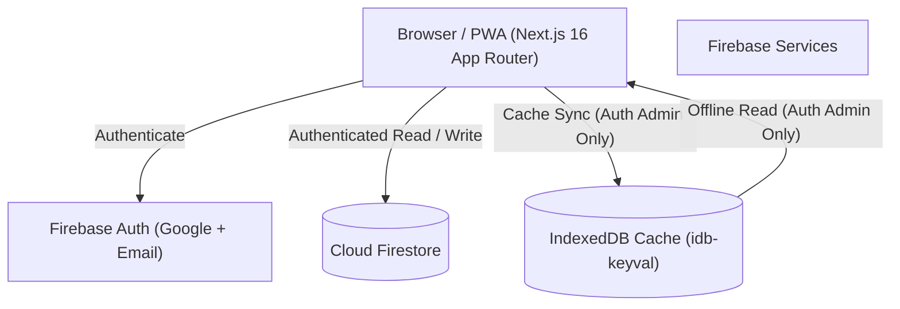

# OushodBox Architecture Documentation

OushodBox is a private, single-administrator medicine reference and price-management workspace built for `mehj49966@gmail.com`.

---

## 1. System Architecture



### Core Technologies
- **Framework**: Next.js 16 (App Router + Turbopack)
- **Language**: TypeScript (Strict mode)
- **Styling**: Tailwind CSS + Custom CSS Design System tokens
- **Database & Auth**: Google Firebase (Client SDK v11)
- **Offline / PWA**: Native Service Worker + IndexedDB (`idb-keyval`)

---

## 2. Route Map

| Route | Type | Description | Access Control |
|---|---|---|---|
| `/` | Client Dashboard | Search bar, stats, shortcuts, recent medicines, quick add modal | Auth Admin gets data; signed out sees private workspace lock screen |
| `/medicines` | Client Registry | Full medicine registry, multi-filter, search, view modes, bulk WhatsApp share | Auth Admin gets data; signed out sees private workspace lock screen |
| `/medicines/[id]` | Server wrapper + Client Container | Complete clinical monograph, price history timeline, equivalent brands | Auth Admin gets monograph; signed out sees private record lock screen |
| `/admin` | Client Console | Comprehensive admin panel for CRUD, price and inventory control | Protected by `AdminAuthGuard`; redirects unauthenticated to `/admin/login` |
| `/admin/login` | Client Auth Entry | 1-click Google Sign-in + Email/Password fallback | Public auth portal; rejects non-admin accounts |
| `/whatsapp-share` | Client Utility | Single and bulk WhatsApp message formatting | Client utility |
| `/upcoming` | Static Info | Information about upcoming offline & sync features | Public |

---

## 3. Security Model

OushodBox employs defense-in-depth security:

1. **Cloud Security Rules (Server-side)**:
   - Evaluated by Cloud Firestore on every read and write.
   - Enforces `isAdmin()` via `request.auth != null && request.auth.token.email == adminEmail()`.
   - Denies read, write, create, update, and delete to all unauthenticated and non-admin requests.
   - Restricts `priceHistory` subcollection to create-only (append-only and immutable).
   - Catch-all default deny on all other paths.

2. **Client-Side Auth Guards**:
   - `AdminAuthGuard` monitors auth state for `/admin`. Unauthenticated users are redirected to `/admin/login`. Unauthorized users are signed out and redirected with `?error=unauthorized`.
   - `MedicineDetailContainer`, `HomePage`, and `MedicineDatabasePage` do not initiate Firestore queries or load IndexedDB cached data until the client SDK confirms an authorized admin session.
   - Local offline cache is completely wiped upon `logout()`.

---

## 4. Offline & PWA Strategy

- **Service Worker**: Registers via `PwaRegistration` component to cache shell assets and static files.
- **IndexedDB Storage**: Uses `idb-keyval` to store a local mirror of the `medicines` collection.
- **Cache Isolation**: Cached medicine records are strictly restricted to authenticated administrator sessions. When signed out or when logging out, cached medicines are cleared to prevent data leaks.
- **Offline Reads**: When network connectivity is lost (`navigator.onLine === false` or Firestore fetch fails), authenticated admins can read cached records with an "অফলাইন মোড" indicator.
- **Offline Writes**: Write operations (add, edit, delete) require a live connection to Firestore to ensure integrity and trigger price history creation. Write attempts while offline produce a clear error message.

---

## 5. Clinical Safety Guard

Medical content integrity is strictly guarded:
- Under no circumstances does the application fabricate, generate, infer, or hallucinate clinical indications, dosages, contraindications, side effects, or pregnancy advisories for newly added or custom medicines.
- Where clinical monograph fields are absent in Firestore, the application renders:
  ```
  "Clinical information is not available yet."
  ```
- This guard is implemented in `buildMonographFromMedicine()` inside `src/lib/firestore/medicines.ts`.
